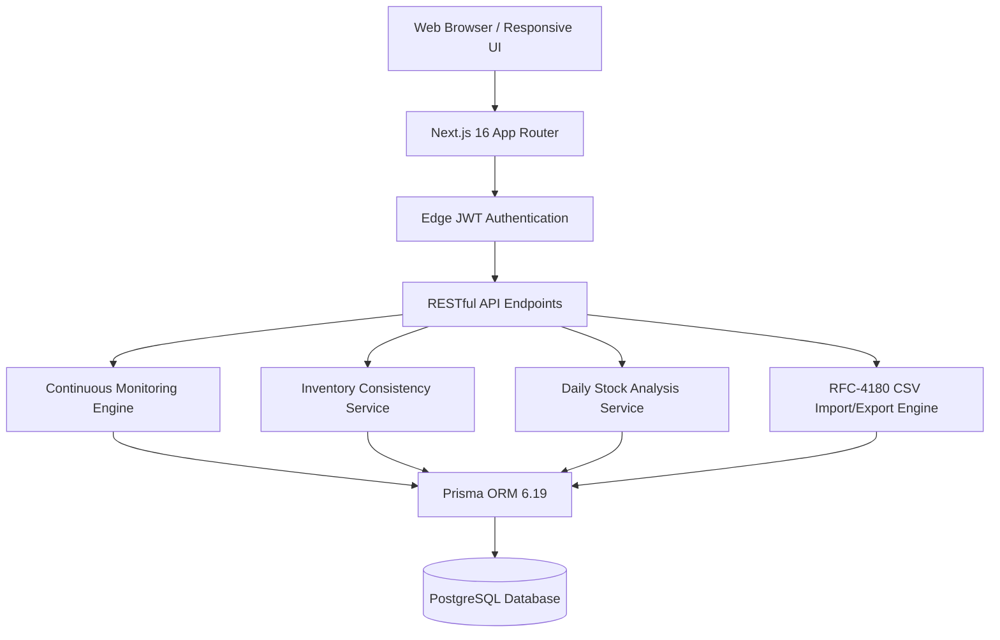

# Smart Inventory Continuous Monitoring System (SICMS)
### Daily Stock Analysis, Expiry Surveillance, Low-Stock Detection & Automated Alerts

[](https://github.com/example/sicms/actions)
[](https://nextjs.org/)
[](https://react.dev/)
[](https://prisma.io/)
[](https://postgresql.org/)
[](https://tailwindcss.com/)
[-6E9F18?logo=vitest)](https://vitest.dev/)

---

## 1. Executive Summary & Core Mission

**SICMS** is a generalized, enterprise-grade **Smart Inventory Continuous Monitoring System** engineered to provide continuous stock surveillance, daily stock analysis, perishable shelf-life tracking, stockout prevention, and automated actionable alerts.

Built without regional or industry-specific constraints, SICMS is designed for diverse inventory environments—including industrial raw materials, electronics, pharmaceuticals, FMCG, automotive spares, food processing, packaging supplies, and general enterprise warehouses.

### Core System Pillars
1. **Daily Stock Analysis**: Computes opening stock, inbound stock received today, outbound stock issued or sold today, current balance, and net daily changes.
2. **Low-Stock & Out-of-Stock Monitoring**: Continuously compares available balance against configurable minimum thresholds, flagging critical zero-stock conditions.
3. **Lot & Expiry Surveillance**: Batch-level surveillance detecting expired lots and items approaching expiration within configurable warning horizons. Expiry tracking is optional for non-perishable products.
4. **Explainable Anomaly Detection**: Identifies unusual stock drops (>35% single-movement deductions without dispatch orders) and rapid manual count adjustments (≥3 corrections within 24h).
5. **Automated Actionable Alerts**: Generates persistent alerts complete with product SKU, batch number, current balance, expiry timeline, alert reason, severity, and specific **Recommended Actions** (e.g. reorder requisition, lot re-allocation, inspection hold).
6. **Configurable Rules & Thresholds**: Authorized inventory managers can fine-tune warning horizons, anomaly percentages, and adjustment limits on the fly via `/api/monitoring/settings`.
7. **Audit & History Ledger**: Immutable, dated stock movement records tracking old vs. new balance, movement reasons, user attributions, and references.
8. **Multi-Format CSV Engine**: High-performance RFC-4180 CSV importer with duplicate detection, row-level error reporting, and live database inventory export.

---

## 2. Multi-Sector Inventory Scope

The system ships with a synthetic, realistic dataset generator (`scripts/generate-dataset.ts`) and seeder (`scripts/seed.ts`) covering **10 diverse industrial and commercial categories** across 10 warehouse storage zones:

| Category | Sample Items | Storage Environments |
|---|---|---|
| **Electronics & Semiconductors** | Microcontroller Boards (ESP32), Op-Amps, OLED Displays, SMD Capacitors | Controlled Humidity & Temp |
| **Pharmaceuticals & Medical** | Paracetamol Tablets, Amoxicillin Capsules, Sterile Saline Infusions, PPE | Cleanroom & Bio-Storage |
| **Industrial Raw Materials** | Polypropylene Granules, Aluminum Extrusions, Stainless Steel Fasteners | Bulk Material Depots |
| **FMCG & Packaged Goods** | Detergent Powder, Liquid Handwash, Toiletries, Cleaning Agents | Ambient General Racks |
| **Food & Perishables** | Durum Semolina, Dairy Products, Cooking Oils, Spices | Cold Storage Vaults (2–8°C / -20°C) |
| **Automotive & Machinery Spares** | Oil Filters, Brake Pads, Drive Belts, Hydraulic Seals | Heavy Parts Warehouse |
| **Laboratory Chemicals & Reagents**| Ethanol 99.9%, Hydrochloric Acid 37%, Sodium Hydroxide Pellets | Flammable & Hazmat Bays |
| **Packaging & Shipping Supplies** | Corrugated Shipping Boxes, Stretch Films, Bubble Rolls | Fast-Pick Staging Bays |
| **Hardware & Fasteners** | Hex Bolts, Drill Bits, Anchor Fasteners, Cable Ties | High-Density Drawer Units |
| **Office & IT Equipment** | Ethernet Patch Cables, Thermal Paper Rolls, Toner Cartridges | Standard Shelving |

---

## 3. Continuous Monitoring Logic

The system's autonomous continuous monitoring engine (`src/services/monitoring.service.ts`) executes:
- **On Every Inventory Change**: When stock is received, issued, adjusted, or reconciled.
- **On Scheduled Periodic Intervals**: Configurable cron / worker execution via `/api/monitoring/run`.
- **On-Demand**: From the UI dashboard and monitoring consoles.

### Alert Classification Matrix
- **`OUT_OF_STOCK` (Severity: CRITICAL)**: Current quantity ≤ 0.
  - *Recommended Action*: Trigger emergency replenishment purchase order or halt downstream manufacturing/dispatch.
- **`LOW_STOCK` (Severity: HIGH)**: Current quantity ≤ `minStockLevel`.
  - *Recommended Action*: Issue reorder requisition for target quantity before stock exhausts.
- **`EXPIRY_WARNING` (Severity: MEDIUM)**: Batch expiry date within configured `expiryWarningDays` (default: 14 days).
  - *Recommended Action*: Expedite dispatch (FEFO), reallocate to high-velocity orders, or initiate promotional markdown.
- **`EXPIRED` (Severity: CRITICAL)**: Batch expiry date has passed and remaining quantity > 0.
  - *Recommended Action*: Quarantine lot immediately, transfer to salvage/destruction holding area, and record disposal movement.
- **`ANOMALY_REVIEW` (Severity: HIGH)**: Sudden stock drops exceeding `anomalyDropPercentage` (default: 35%) or ≥ `rapidAdjustmentLimit` (default: 3) manual adjustments in 24 hours.
  - *Recommended Action*: Conduct physical cycle count audit and inspect CCTV/access logs for unaccounted shrinkage.

Alerts are idempotently created or updated, avoiding duplicate alert flooding, and are **automatically resolved** when inventory is replenished above threshold levels.

---

## 4. Architecture & Technical Stack



- **Frontend**: Next.js 16 (App Router), React 19, Tailwind CSS, Lucide Icons, Recharts.
- **Backend**: Next.js Route Handlers, Zod Validation, Jose (JWT Authentication), Bcryptjs.
- **Database**: PostgreSQL 16 managed via Prisma ORM with atomic `$transaction` consistency.
- **Testing**: Vitest 5 with isolated unit and integration suites.

---

## 5. Quick Start & Local Setup

### Prerequisites
- **Node.js** v20.x or v24.x
- **npm** v10+

### Installation Steps

1. **Clone the repository**:
   ```bash
   git clone <repo-url>
   cd SICMS
   ```

2. **Install dependencies**:
   ```bash
   npm install --legacy-peer-deps
   ```

3. **Configure Environment Variables**:
   Copy `.env.example` to `.env`:
   ```bash
   cp .env.example .env
   ```

4. **Initialize Database**:
   Synchronize schema tables using Prisma:
   ```bash
   npm run db:push
   ```

5. **Seed Generalized Multi-Sector Dataset**:
   Populates administrative users, categories, warehouse zones, suppliers, 200 items, batches, movements, and initial alerts:
   ```bash
   npm run db:seed
   ```

6. **Start the Development Server**:
   ```bash
   npm run dev
   ```
   Access the dashboard at: `http://localhost:3000`

---

## 6. Default Credentials

| Role | Email | Password | Access Level |
|---|---|---|---|
| **Administrator** | `admin@sicms.io` | `Admin@12345` | Full system access, rule configuration, audit ledger, and user management |
| **Inventory Officer** | `staff@sicms.io` | `Staff@12345` | Stock receipts, dispatches, audits, and alert acknowledgments |

---

## 7. Testing & Quality Assurance

The codebase includes automated tests validating core business rules:

```bash
# Run Vitest test suite
npm test

# Run production build
npm run build
```

### Verified Test Suites
- `tests/inventory.service.test.ts`: Atomic stock-in, stock-out, strict shortage rejection, and audit reconciliation.
- `tests/monitoring.service.test.ts`: Low-stock, out-of-stock, expiry warning horizons, and replenishment auto-resolution.
- `tests/csv.service.test.ts`: RFC-4180 parsing, serialization, duplicate detection, and row-level error reporting.

---

## 8. Deployment

For serverless deployments (e.g. Vercel):
- Database connection strings should configure pooling via PgBouncer or Supabase / Neon connection pooler.
- Scheduled monitoring is triggered via Vercel Cron Jobs configured in `vercel.json` targeting `/api/monitoring/run` with `CRON_SECRET` authorization header.

---

## 9. License

MIT License. Designed and engineered for production smart inventory continuous monitoring.
